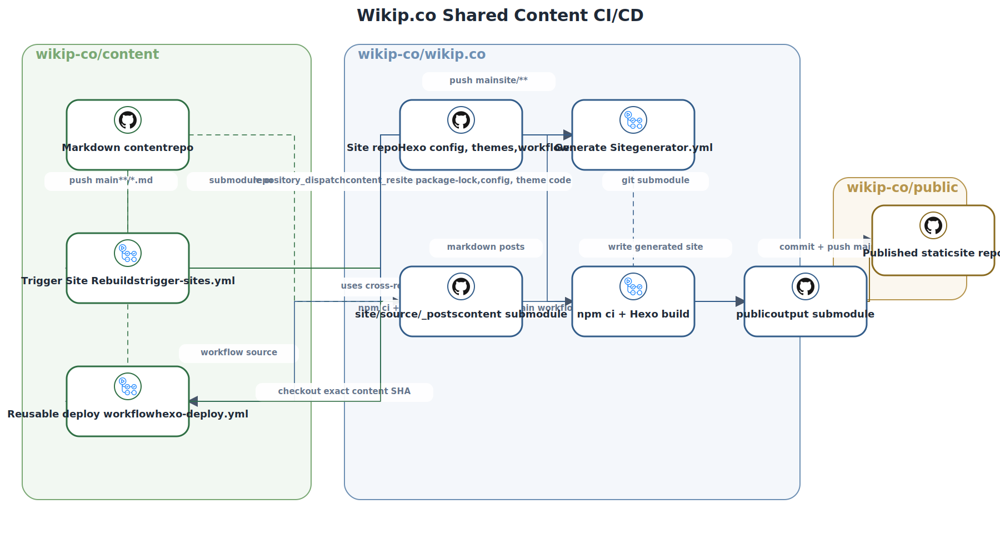

# wikip.co
A static wiki built with node.js

- Architecture
  - `site/source/_posts` is the shared `wikip-co/content` submodule.
  - `public` is the generated static-site submodule published separately.
  - The site repo owns Hexo config, themes, workflow glue, and deploy behavior.

- URLs
  - Cloudflare:
    - https://wikip.co/
    - https://www.wikip.co/
    - https://public-kb6.pages.dev/
  - Fleek.co
    - https://ipfs.wikip.co/
    - https://wikip.on.fleek.co/

- Docker
  - https://hub.docker.com/r/anthonyrussano/wikip.co
  - `docker run -p 4000:4000 anthonyrussano/wikip.co`

- Local setup
  - `git submodule update --init --recursive`
  - `npm ci --prefix site`
  - `npm --prefix site run build`

- Workflow
  - Site-only changes under `site/**` build on push.
  - Content changes arrive through `repository_dispatch` from `wikip-co/content`.
  - The deploy workflow builds against the exact content SHA provided in that dispatch payload.

## CI/CD Diagram

Source spec: [`docs/diagrams/specs/wikip-content-public-cicd.yaml`](docs/diagrams/specs/wikip-content-public-cicd.yaml)

Rendered artifact: [`docs/diagrams/rendered/wikip-content-public-cicd.svg`](docs/diagrams/rendered/wikip-content-public-cicd.svg)

The diagram shows both deploy entrypoints: content pushes in `wikip-co/content` dispatch an exact content SHA into `wikip.co`, and site-only pushes in `wikip.co` trigger the site workflow directly. The `Generate Site` workflow then uses the reusable deploy workflow from `wikip-co/content`, builds Hexo against `site/source/_posts`, and publishes the generated output to `wikip-co/public`.
